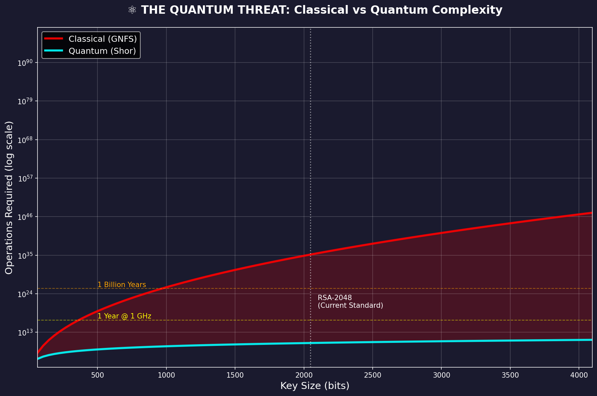
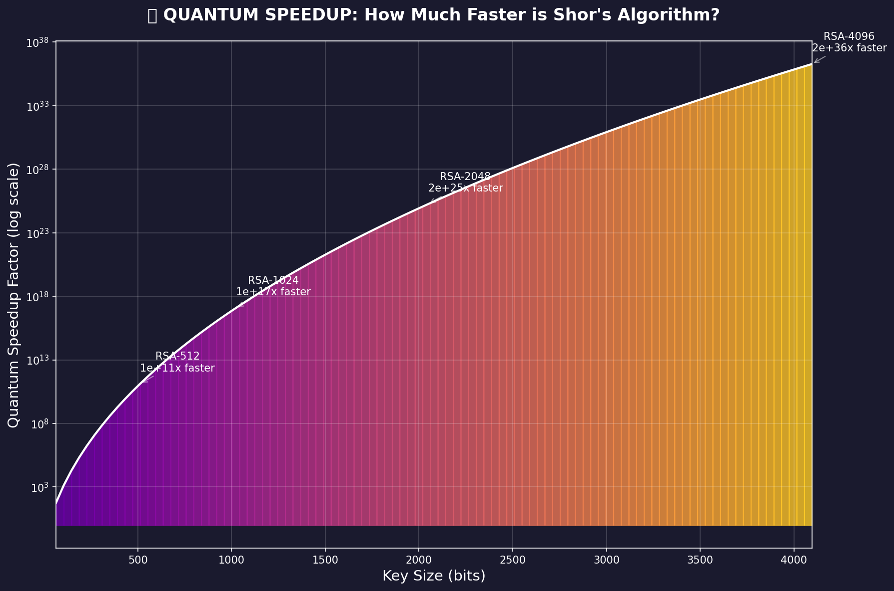
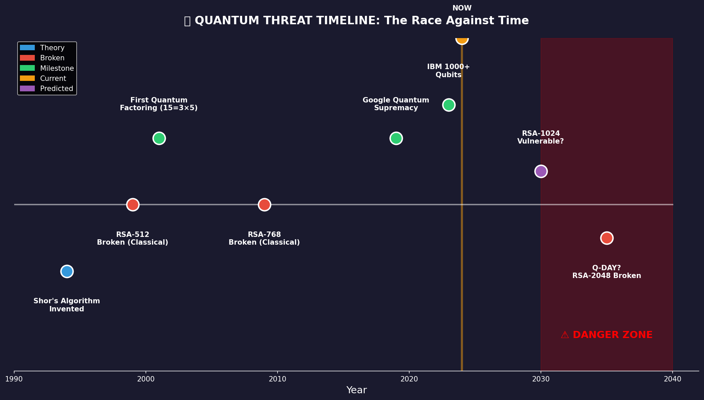
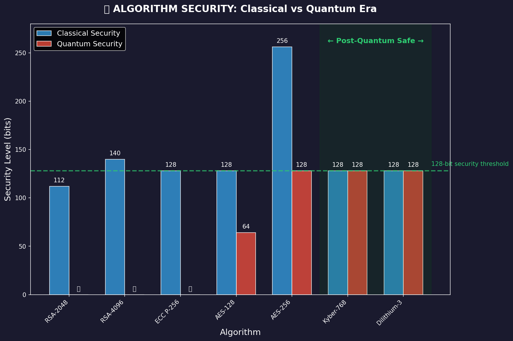
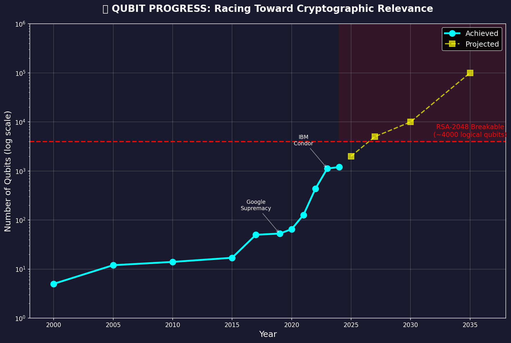

# Quantum Threats to Classical Cryptography

> **An Educational Exploration of Post-Quantum Security**

A comprehensive educational project demonstrating the theoretical foundations of quantum computational threats to classical cryptographic systems, alongside an introduction to post-quantum cryptography (PQC) standards.

---

## ⚠️ Important Educational Disclaimer

**This project is intended solely for educational and conceptual learning purposes.**

The implementations provided here are:

- **Simplified pedagogical demonstrations**, not production-ready cryptographic code
- **Not constant-time** and therefore vulnerable to timing side-channel attacks
- **Not cryptographically secure** — do not use for any real-world applications
- **Simulations or toy examples** — the Shor's algorithm demonstration uses classical simulation or simplified quantum circuits that do not represent actual cryptanalytic attacks

For production post-quantum cryptography, use established libraries such as:
- [liboqs (Open Quantum Safe)](https://openquantumsafe.org/)
- [PQClean](https://github.com/PQClean/PQClean)
- [pqcrypto](https://github.com/pqcrypto)

---

## 📊 Visualizations

### Classical vs Quantum Computational Complexity


### Quantum Speedup Factor (Theoretical)


### Threat Timeline (Speculative Estimates)


### Algorithm Security Comparison


### Qubit Progress (Historical)


---

## 📚 What You'll Learn

1. **RSA Fundamentals** — The mathematical structure securing much of today's internet
2. **Classical Security of RSA** — Why integer factorization is believed to be computationally hard for classical computers
3. **Shor's Algorithm** — The quantum algorithm that, in principle, efficiently solves integer factorization
4. **The Quantum Threat Timeline** — Scenario-based projections and their significant uncertainties
5. **Post-Quantum Solutions** — NIST-standardized algorithms designed to resist both classical and quantum attacks
6. **Lattice-Based Cryptography** — Learning With Errors (LWE) and its role in modern PQC

---

## 📁 Project Structure

```
Quantum-crypto/
├── 01_rsa_basics.py              # RSA encryption fundamentals
├── 02_classical_attack.py        # Classical factorization methods (trial division, Pollard's rho)
├── 03_shors_algorithm.py         # Educational Shor's algorithm simulation
├── 04_comparison.py              # Classical vs quantum complexity comparison
├── 05_post_quantum.py            # Introduction to NIST PQC standards
├── 06_visualizations.py          # Generate threat visualizations
├── 07_advanced_post_quantum.py   # Simplified LWE, Kyber-like, SPHINCS+-like demos
├── visualizations/
│   ├── 01_complexity_comparison.png
│   ├── 02_quantum_speedup.png
│   ├── 03_threat_timeline.png
│   ├── 04_algorithm_comparison.png
│   └── 05_qubit_progress.png
├── requirements.txt
└── README.md
```

---

## 🚀 Quick Start

```bash
# Install dependencies
pip install -r requirements.txt

# Run each module sequentially
python 01_rsa_basics.py
python 02_classical_attack.py
python 03_shors_algorithm.py
python 04_comparison.py
python 05_post_quantum.py
python 06_visualizations.py         # Generates visualization charts
python 07_advanced_post_quantum.py  # Simplified PQC concept demonstrations
```

---

## 🔐 Cryptographic Algorithm Comparison

### Classical vs Quantum Security Overview

| Algorithm | Classical Attack Complexity | Quantum Attack Complexity | Current Status |
|-----------|----------------------------|---------------------------|----------------|
| **RSA-2048** | Sub-exponential (GNFS)¹ | Polynomial time (Shor's)² | Theoretically vulnerable to future quantum computers |
| **AES-256** | ~2²⁵⁶ operations | ~2¹²⁸ operations (Grover's)³ | Currently believed secure with sufficient margin |
| **ML-KEM (Kyber)** | Believed secure⁴ | Believed secure⁴ | NIST FIPS 203 — Standardized |
| **ML-DSA (Dilithium)** | Believed secure⁴ | Believed secure⁴ | NIST FIPS 204 — Standardized |
| **SLH-DSA (SPHINCS+)** | Believed secure⁴ | Believed secure⁴ | NIST FIPS 205 — Standardized |

**Footnotes:**

¹ *The General Number Field Sieve (GNFS) has heuristic complexity L_n[1/3, c] where c ≈ 1.9. This is sub-exponential but super-polynomial in the bit-length of N.*

² *Shor's algorithm runs in polynomial time with respect to the input size. The precise complexity depends on implementation details including the arithmetic circuits used for modular exponentiation and the fault-tolerance overhead. Often cited as O(n²log(n)log(log(n))) or O(n³) depending on assumptions about circuit depth and gate counts. These figures should be understood as asymptotic and implementation-dependent.*

³ *Grover's algorithm provides a quadratic speedup for unstructured search, reducing brute-force key search from 2²⁵⁶ to approximately 2¹²⁸ operations for AES-256. This margin is currently believed sufficient for long-term security.*

⁴ *"Believed secure" indicates that no efficient classical or quantum algorithm is currently known to break these schemes. Security is based on the presumed hardness of underlying mathematical problems (e.g., Module-LWE, hash function properties) under current cryptanalytic knowledge. This is not a mathematical proof of security.*

---

##  Understanding Shor's Algorithm

### What Shor's Algorithm Demonstrates

Shor's algorithm (1994) is a **quantum algorithm** that can factor integers in polynomial time, which would break RSA, DSA, and Elliptic Curve cryptography if implemented on a sufficiently powerful, error-corrected quantum computer.

### Important Clarifications

| Aspect | Reality |
|--------|---------|
| **What this project demonstrates** | Classical simulations and simplified quantum circuit concepts using Qiskit |
| **What this does NOT represent** | An actual cryptographic attack or a threat to real-world RSA keys |
| **RSA-2048 status** | **Far beyond current quantum capabilities** — no existing quantum computer can factor numbers of cryptographic relevance |
| **Toy examples** | Factoring small numbers (e.g., 15, 21) for educational illustration only |

### Qubit Requirements: A Nuanced View

Estimates for the quantum resources required to break RSA-2048 vary significantly based on architectural assumptions:

| Source | Logical Qubits | Physical Qubits | Key Assumptions |
|--------|---------------|-----------------|-----------------|
| Gidney & Ekerå (2021)¹ | ~20 million physical qubits | ~20 million | Optimized circuits, 8-hour runtime, surface code error correction with ~0.1% gate error rates |
| Earlier estimates | ~4,000 logical qubits | Millions (dependent on error correction overhead) | Varies by error model and code distance |

**Key Points:**
- **Logical vs. Physical Qubits**: Logical qubits are error-corrected abstractions; each requires many physical qubits (the ratio depends on error rates and error-correction codes)
- **These estimates are model-dependent**: Actual requirements depend on qubit coherence times, gate fidelities, connectivity, and the specific error-correction scheme employed
- **No single number is universal**: Different assumptions yield different estimates

¹ Gidney, C., & Ekerå, M. (2021). "How to factor 2048 bit RSA integers in 8 hours using 20 million noisy qubits." *Quantum*, 5, 433.

---

## Quantum Threat Timeline: Uncertainties and Caveats

### Scenario-Based Projections (Speculative)

| Scenario | Timeframe | Description |
|----------|-----------|-------------|
| Conservative | 2040+ | Assumes slow progress in error correction and qubit coherence |
| Moderate | 2035–2040 | Assumes continued progress consistent with recent trends |
| Optimistic | 2030–2035 | Assumes major breakthroughs in hardware and error correction |

**⚠️ Critical Notes:**

- **All timelines are speculative** and reflect informed estimates, not predictions
- **Expert opinions vary widely** — some researchers believe cryptographically relevant quantum computers (CRQCs) are decades away, while others suggest shorter timescales under optimistic scenarios
- **NIST has set 2035** as a transition milestone for federal systems to migrate away from quantum-vulnerable algorithms (this is a policy deadline, not a threat prediction)
- **"Harvest Now, Decrypt Later" (HNDL)**: This is a well-founded concern — adversaries may collect encrypted data today with the intent to decrypt it once quantum capabilities mature. This makes early migration strategically important for long-lived secrets.

---

## 🛡️ Post-Quantum Cryptography (NIST Standards)

The following algorithms have been standardized by NIST as part of the Post-Quantum Cryptography Standardization Process:

| NIST Standard | Algorithm Family | Use Case | Underlying Problem |
|---------------|-----------------|----------|-------------------|
| **FIPS 203 (ML-KEM)** | CRYSTALS-Kyber | Key Encapsulation Mechanism (KEM) | Module Learning With Errors (MLWE) |
| **FIPS 204 (ML-DSA)** | CRYSTALS-Dilithium | Digital Signatures | Module Learning With Errors (MLWE) / Module SIS |
| **FIPS 205 (SLH-DSA)** | SPHINCS+ | Digital Signatures | Hash function security (stateless hash-based) |

**Security Basis:**

These algorithms are **believed to be secure against both classical and currently known quantum attacks**, based on:
- Extensive cryptanalysis during the NIST standardization process
- The presumed hardness of lattice problems (for ML-KEM and ML-DSA) and hash function properties (for SLH-DSA)

**This belief is based on current cryptanalytic knowledge, not unconditional mathematical proof.**

As with all cryptography, security assumptions may evolve as new attacks are discovered.

---

## 🔬 What This Project Implements (Educational Only)

| Module | Description | Limitations |
|--------|-------------|-------------|
| `01_rsa_basics.py` | RSA key generation and encryption fundamentals | Small key sizes for demonstration |
| `02_classical_attack.py` | Trial division, Pollard's rho factorization | Illustrates why these fail for large keys |
| `03_shors_algorithm.py` | Shor's algorithm concepts and classical simulation | Uses classical period-finding; Qiskit circuit is simplified and does not implement full modular exponentiation |
| `04_comparison.py` | Complexity comparison tables | Conceptual, not empirical benchmarks |
| `05_post_quantum.py` | Overview of NIST PQC standards | Informational only |
| `06_visualizations.py` | Chart generation | Visualization of educational concepts |
| `07_advanced_post_quantum.py` | Simplified LWE, Kyber-like, SPHINCS+-like demos | **Not cryptographically secure** — simplified for conceptual understanding |

---

## 📖 References

### Primary Academic Sources

- Shor, P. W. (1994). "Algorithms for quantum computation: discrete logarithms and factoring." *Proceedings 35th Annual Symposium on Foundations of Computer Science*, 124–134.
- Gidney, C., & Ekerå, M. (2021). "How to factor 2048 bit RSA integers in 8 hours using 20 million noisy qubits." *Quantum*, 5, 433. [arXiv:1905.09749](https://arxiv.org/abs/1905.09749)
- Regev, O. (2005). "On lattices, learning with errors, random linear codes, and cryptography." *STOC '05*, 84–93.

### Standards and Guidelines

- [NIST Post-Quantum Cryptography](https://csrc.nist.gov/projects/post-quantum-cryptography)
- [NIST FIPS 203 (ML-KEM)](https://csrc.nist.gov/pubs/fips/203/final)
- [NIST FIPS 204 (ML-DSA)](https://csrc.nist.gov/pubs/fips/204/final)
- [NIST FIPS 205 (SLH-DSA)](https://csrc.nist.gov/pubs/fips/205/final)

### Tools and Libraries

- [Qiskit](https://qiskit.org/) — IBM's open-source SDK for quantum computing
- [Open Quantum Safe (liboqs)](https://openquantumsafe.org/) — Production PQC implementations
- [PQClean](https://github.com/PQClean/PQClean) — Clean, portable PQC implementations

---

## License

MIT License — For educational use.

---

## Summary

| Key Point | Status |
|-----------|--------|
| RSA-2048 is currently secure | ✅ Yes — no existing quantum computer can break it |
| Quantum computers will eventually threaten RSA | ⚠️ Theoretically well-founded, timeline uncertain |
| Post-quantum algorithms are available | ✅ Yes — NIST has standardized ML-KEM, ML-DSA, SLH-DSA |
| Migration should begin now | ⚠️ Recommended for long-term secrets due to HNDL risk |
| This project is for learning | ✅ Yes — not for production use |

---

**Remember**: This project demonstrates *theoretical concepts*. The quantum threat to cryptography is **real but not imminent**. Current quantum computers are not capable of breaking cryptographically relevant key sizes. However, the strategic importance of early preparation — particularly for data with long-term secrecy requirements — is widely recognized by the cryptographic community.

> *"It is difficult to make predictions, especially about the future."* — attributed to various sources

Begin exploring post-quantum cryptography today, but approach timeline claims with appropriate scientific skepticism.
