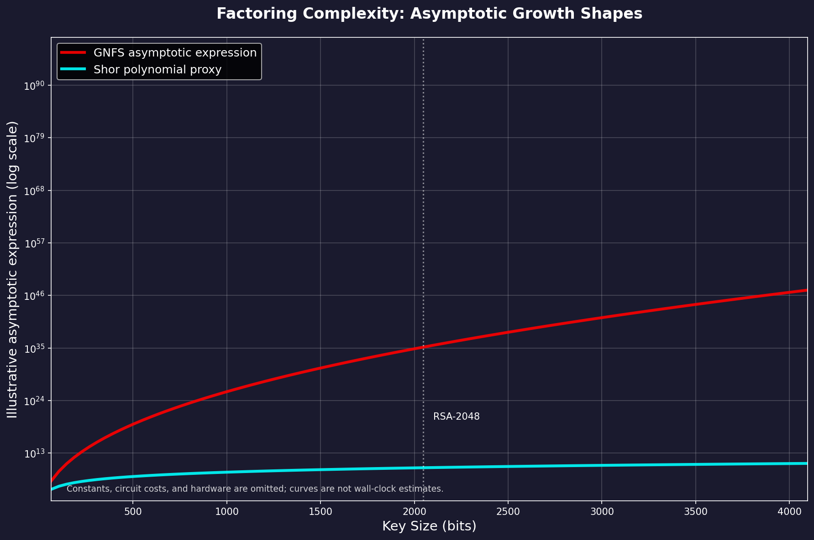
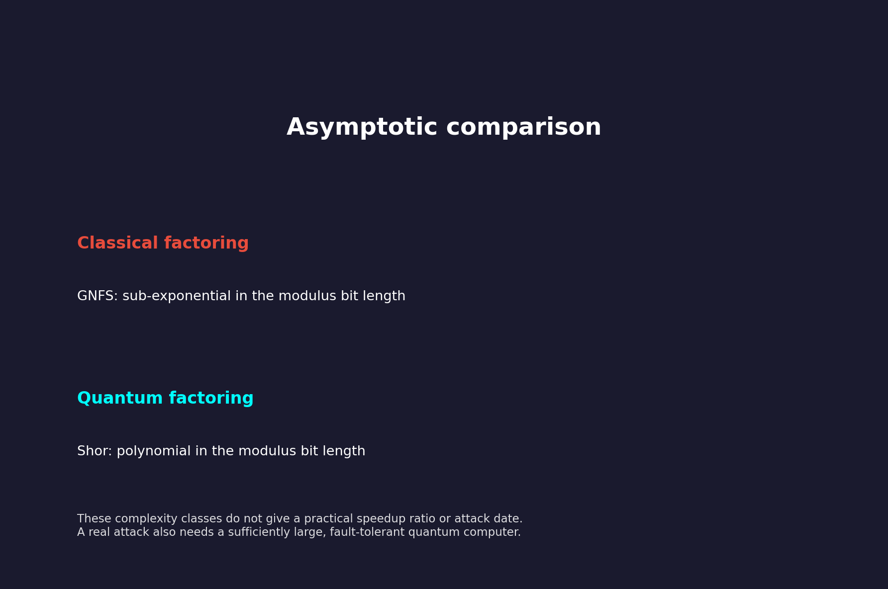
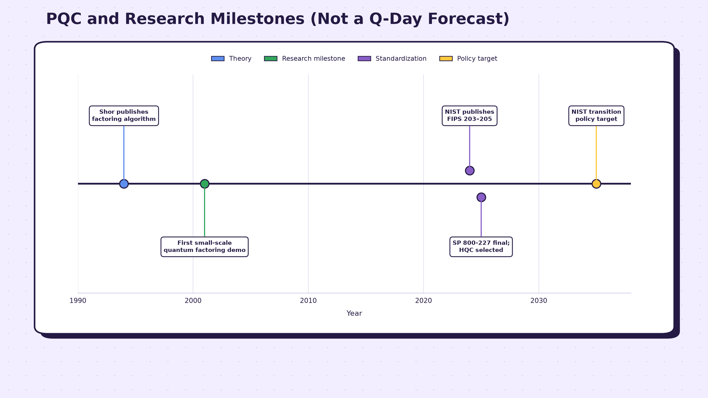
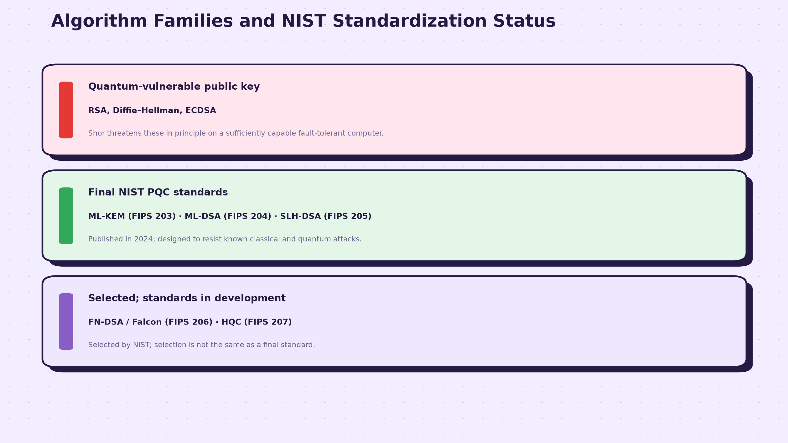
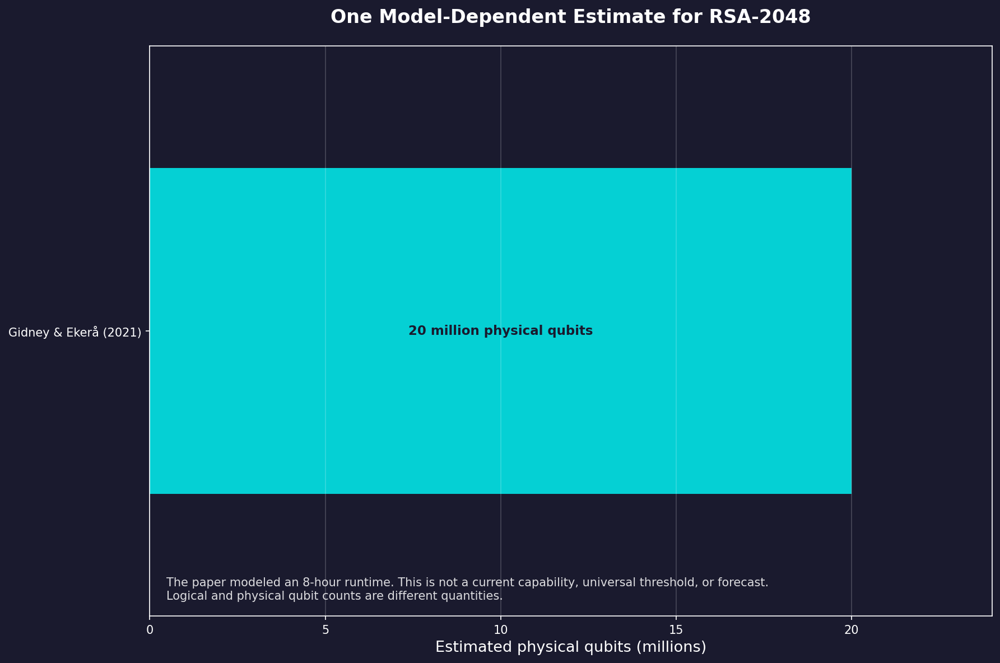

# Quantum Threats to Classical Cryptography

> **An Educational Exploration of Post-Quantum Security**

A comprehensive educational project demonstrating the theoretical foundations of quantum computational threats to classical cryptographic systems, alongside an introduction to post-quantum cryptography (PQC) standards.
 
---
 
##  Important Educational Disclaimer

**This project is intended solely for educational and conceptual learning purposes.**

The implementations provided here are:

- **Simplified pedagogical demonstrations**, not production-ready cryptographic code
- **Not constant-time** and therefore vulnerable to timing side-channel attacks
- **Not cryptographically secure** — do not use for any real-world applications
- **Simulations or toy examples** — the Shor's algorithm demonstration uses classical simulation or simplified quantum circuits that do not represent actual cryptanalytic attacks

For production systems, use an actively maintained cryptographic provider that implements the applicable NIST standards and fits your deployment and compliance requirements. This project does not endorse a production implementation. The Open Quantum Safe project describes `liboqs` as research and prototyping software, and the PQClean repository is retired; see the [liboqs security policy](https://openquantumsafe.org/liboqs/security.html) and [PQClean project status](https://github.com/PQClean/PQClean).

---

##  Visualizations

### Classical vs Quantum Computational Complexity


### Asymptotic Complexity Classes (Conceptual)


### Migration Milestones (Not a Hardware Forecast)


### Algorithm Families and Standardization Status


### RSA-2048 Resource Estimate (Illustrative)


---

##  What You'll Learn

1. **RSA Fundamentals** — The mathematical structure securing much of today's internet
2. **Classical Security of RSA** — Why integer factorization is believed to be computationally hard for classical computers
3. **Shor's Algorithm** — The quantum algorithm that, in principle, efficiently solves integer factorization
4. **Migration Milestones** — NIST policy dates and why they are not hardware forecasts
5. **Post-Quantum Solutions** — NIST-standardized algorithms designed to resist both classical and quantum attacks
6. **Lattice-Based Cryptography** — Learning With Errors (LWE) and its role in modern PQC

---

##  Project Structure

```
Quantum-crypto/
├── notebooks/                        # 📓 Interactive Jupyter Notebooks (RECOMMENDED)
│   ├── 01_RSA_and_Classical_Security.ipynb
│   ├── 02_Shors_Algorithm_Simulation.ipynb
│   ├── 03_Quantum_Threat_Visualizations.ipynb
│   └── 04_Post_Quantum_Standards_NIST.ipynb
│
├── 01_rsa_basics.py                  # Legacy Python scripts
├── 02_classical_attack.py
├── 03_shors_algorithm.py
├── 04_comparison.py
├── 05_post_quantum.py
├── 06_visualizations.py
├── 07_advanced_post_quantum.py
│
├── visualizations/
│   ├── 01_complexity_comparison.png
│   ├── 02_quantum_speedup.png
│   ├── 03_threat_timeline.png
│   ├── 04_algorithm_comparison.png
│   └── 05_qubit_progress.png
│
├── requirements.txt
└── README.md
```

---

##  Jupyter Notebooks (Recommended Learning Path)

For the best learning experience, we recommend using the **interactive Jupyter Notebooks** which combine:
- **LaTeX-rendered mathematical equations** for rigorous theory
- **Executable code cells** with inline visualizations
- **Narrative flow** that guides you through each concept

### Notebook Overview

| Notebook | Topics Covered | Prerequisites |
|----------|----------------|---------------|
| **01_RSA_and_Classical_Security** | RSA math (Euler's theorem), key generation, encryption/decryption, trial division attack, Pollard's rho | Basic Python |
| **02_Shors_Algorithm_Simulation** | Quantum period finding, QFT, Qiskit simulation, classical vs quantum complexity | Notebook 01 |
| **03_Quantum_Threat_Visualizations** | Threat timelines, complexity comparisons, qubit scaling | Notebook 01-02 |
| **04_Post_Quantum_Standards_NIST** | ML-KEM, ML-DSA, SLH-DSA, LWE problem, lattice cryptography | Notebook 01-03 |

### Running the Notebooks

```bash
# Install Jupyter (if not already installed)
pip install jupyter

# Launch Jupyter Notebook
jupyter notebook notebooks/

# Or use JupyterLab for a modern interface
pip install jupyterlab
jupyter lab notebooks/
```

---

##  Quick Start

```bash
# Install dependencies
pip install -r requirements.txt

# Run each module sequentially
python 01_rsa_basics.py
python 02_classical_attack.py
python 03_shors_algorithm.py
python 04_comparison.py
python 05_post_quantum.py
python 06_visualizations.py         # Generates visualization charts
python 07_advanced_post_quantum.py  # Simplified PQC concept demonstrations
```

---

## 🔐 Cryptographic Algorithm Comparison

### Classical vs Quantum Security Overview

| Algorithm | Classical Attack Complexity | Quantum Attack Complexity | Current Status |
|-----------|----------------------------|---------------------------|----------------|
| **RSA-2048** | Sub-exponential (GNFS)¹ | Polynomial time (Shor's)² | Theoretically vulnerable to future quantum computers |
| **AES-256** | ~2²⁵⁶ classical key guesses | ~2¹²⁸ quantum queries (idealized Grover model)³ | Currently believed secure with sufficient margin |
| **ML-KEM (Kyber)** | Believed secure⁴ | Believed secure⁴ | NIST FIPS 203 — Standardized |
| **ML-DSA (Dilithium)** | Believed secure⁴ | Believed secure⁴ | NIST FIPS 204 — Standardized |
| **SLH-DSA (SPHINCS+)** | Believed secure⁴ | Believed secure⁴ | NIST FIPS 205 — Standardized |

**Footnotes:**

¹ *The General Number Field Sieve (GNFS) has heuristic complexity L_n[1/3, c] where c ≈ 1.9. This is sub-exponential but super-polynomial in the bit-length of N.*

² *Shor's algorithm runs in polynomial time with respect to the input size. The precise complexity depends on implementation details including the arithmetic circuits used for modular exponentiation and the fault-tolerance overhead. Often cited as O(n²log(n)log(log(n))) or O(n³) depending on assumptions about circuit depth and gate counts. These figures should be understood as asymptotic and implementation-dependent.*

³ *In the idealized quantum query model, Grover's algorithm reduces an exhaustive AES-256 key search from about 2²⁵⁶ to about 2¹²⁸ queries. This is a complexity statement, not a complete security guarantee for a real implementation.*

⁴ *"Believed secure" indicates that no efficient classical or quantum algorithm is currently known to break these schemes. Security is based on the presumed hardness of underlying mathematical problems (e.g., Module-LWE, hash function properties) under current cryptanalytic knowledge. This is not a mathematical proof of security.*

---

##  Understanding Shor's Algorithm

### What Shor's Algorithm Demonstrates

Shor's algorithm (1994) is a **quantum algorithm** that can factor integers in polynomial time, which would break RSA, DSA, and Elliptic Curve cryptography if implemented on a sufficiently powerful, error-corrected quantum computer.

### Important Clarifications

| Aspect | Reality |
|--------|---------|
| **What this project demonstrates** | Classical simulations and simplified quantum circuit concepts using Qiskit |
| **What this does NOT represent** | An actual cryptographic attack or a threat to real-world RSA keys |
| **RSA-2048 status** | **Far beyond current quantum capabilities** — no existing quantum computer can factor numbers of cryptographic relevance |
| **Toy examples** | Factoring small numbers (e.g., 15, 21) for educational illustration only |

### Quantum Resource Estimates: A Nuanced View

Estimates for the quantum resources required to break RSA-2048 vary significantly based on architectural assumptions:

| Source | Estimated physical qubits | Target runtime | Key assumptions |
|--------|---------------------------|---------------|-----------------|
| Gidney & Ekerå (2021)¹ | About 20 million | 8 hours | Their circuit, hardware, and error-correction model |
| Other estimates | Varies | Varies | Different circuits and error models produce different resource requirements |

**Key Points:**
- **Logical vs. Physical Qubits**: Logical qubits are error-corrected abstractions; each requires many physical qubits (the ratio depends on error rates and error-correction codes)
- **These estimates are model-dependent**: Actual requirements depend on qubit coherence times, gate fidelities, connectivity, and the specific error-correction scheme employed
- **No single number is a universal threshold**: These are resource estimates, not forecasts of when a capable machine will exist

¹ Gidney, C., & Ekerå, M. (2021). "How to factor 2048 bit RSA integers in 8 hours using 20 million noisy qubits." *Quantum*, 5, 433.

---

## Migration Milestones and Uncertainty

There is no reliable date for a cryptographically relevant quantum computer. Treat dates below as standards and migration milestones, not predictions about quantum hardware.

| Date | Milestone |
|------|-----------|
| 2024 | NIST published the first three final PQC standards: FIPS 203, 204, and 205 |
| 2025 | NIST published final SP 800-227 guidance for using key-encapsulation mechanisms and selected HQC for standardization |
| 2035 | NIST's transition guidance targets removing quantum-vulnerable public-key algorithms from its standards; high-risk systems are expected to transition earlier |

NIST IR 8547 describes the transition schedule, but remains an initial public draft. Its dates are policy guidance, not a forecast of when a quantum computer will be capable of breaking RSA. See the [NIST PQC transition guidance](https://csrc.nist.gov/pubs/ir/8547/ipd) and [NIST's current PQC overview](https://csrc.nist.gov/projects/post-quantum-cryptography).

**"Harvest Now, Decrypt Later" (HNDL)** remains relevant for information that must stay confidential for many years: an adversary could record encrypted data now and attempt to decrypt it if future capabilities become available.

---

##  Post-Quantum Cryptography (NIST Standards)

The following three algorithms are final NIST standards:

| NIST Standard | Algorithm Family | Use Case | Underlying Problem |
|---------------|-----------------|----------|-------------------|
| **FIPS 203 (ML-KEM)** | CRYSTALS-Kyber | Key Encapsulation Mechanism (KEM) | Module Learning With Errors (MLWE) |
| **FIPS 204 (ML-DSA)** | CRYSTALS-Dilithium | Digital Signatures | Module Learning With Errors (MLWE) / Module SIS |
| **FIPS 205 (SLH-DSA)** | SPHINCS+ | Digital Signatures | Hash function security (stateless hash-based) |

NIST has also selected two additional algorithms for standardization. As of October 2026, both standards are still in development; selection does not mean a final standard is available:

| Algorithm | Intended standard | Use | Status |
|-----------|------------------|-----|--------|
| FN-DSA (based on Falcon) | FIPS 206 | Digital signatures | Selected; standard in development |
| HQC | FIPS 207 | Key encapsulation | Selected in March 2025; standard in development |

NIST's [SP 800-227](https://csrc.nist.gov/pubs/sp/800/227/final), published in September 2025, provides guidance for implementing and using KEMs, including ML-KEM.

**Security Basis:**

These algorithms are **believed to be secure against both classical and currently known quantum attacks**, based on:
- Extensive cryptanalysis during the NIST standardization process
- The presumed hardness of lattice problems (for ML-KEM and ML-DSA) and hash function properties (for SLH-DSA)

**This belief is based on current cryptanalytic knowledge, not unconditional mathematical proof.**

As with all cryptography, security assumptions may evolve as new attacks are discovered.

---

##  What This Project Implements (Educational Only)

| Module | Description | Limitations |
|--------|-------------|-------------|
| `01_rsa_basics.py` | RSA key generation and encryption fundamentals | Small key sizes for demonstration |
| `02_classical_attack.py` | Trial division, Pollard's rho factorization | Illustrates why these fail for large keys |
| `03_shors_algorithm.py` | Shor's algorithm concepts and classical simulation | Uses classical period-finding; Qiskit circuit is simplified and does not implement full modular exponentiation |
| `04_comparison.py` | Complexity comparison tables | Conceptual, not empirical benchmarks |
| `05_post_quantum.py` | Overview of NIST PQC standards | Informational only |
| `06_visualizations.py` | Chart generation | Visualization of educational concepts |
| `07_advanced_post_quantum.py` | Simplified LWE, Kyber-like, SPHINCS+-like demos | **Not cryptographically secure** — simplified for conceptual understanding |

---

## 📖 References

### Primary Academic Sources

- Shor, P. W. (1994). "Algorithms for quantum computation: discrete logarithms and factoring." *Proceedings 35th Annual Symposium on Foundations of Computer Science*, 124–134.
- Gidney, C., & Ekerå, M. (2021). "How to factor 2048 bit RSA integers in 8 hours using 20 million noisy qubits." *Quantum*, 5, 433. [arXiv:1905.09749](https://arxiv.org/abs/1905.09749)
- Regev, O. (2005). "On lattices, learning with errors, random linear codes, and cryptography." *STOC '05*, 84–93.

### Standards and Guidelines

- [NIST Post-Quantum Cryptography](https://csrc.nist.gov/projects/post-quantum-cryptography)
- [NIST FIPS 203 (ML-KEM)](https://csrc.nist.gov/pubs/fips/203/final)
- [NIST FIPS 204 (ML-DSA)](https://csrc.nist.gov/pubs/fips/204/final)
- [NIST FIPS 205 (SLH-DSA)](https://csrc.nist.gov/pubs/fips/205/final)

### Tools and Libraries

- [Qiskit documentation](https://quantum.cloud.ibm.com/docs/en/guides/install-qiskit) — IBM's open-source SDK for quantum computing
- [Open Quantum Safe (liboqs)](https://openquantumsafe.org/) — Research and prototyping resources
- [NIST PQC migration project](https://www.nccoe.nist.gov/applied-cryptography/migration-to-pqc) — Migration planning resources

---

## License

MIT License — For educational use.

---

## Summary

| Key Point | Status |
|-----------|--------|
| RSA-2048 factoring status | ✅ No known classical or current quantum computer can factor it |
| Quantum computers will eventually threaten RSA | ⚠️ Theoretically well-founded, timeline uncertain |
| Post-quantum algorithms are available | ✅ Yes — NIST has standardized ML-KEM, ML-DSA, SLH-DSA |
| Migration should begin now | ⚠️ Recommended for long-term secrets due to HNDL risk |
| This project is for learning | ✅ Yes — not for production use |

---

**Remember**: This project demonstrates *theoretical concepts*. Current quantum computers cannot break cryptographically relevant RSA keys, and the timeline for a capable fault-tolerant machine is unknown. Early migration planning matters especially for data with long-term secrecy requirements.

Begin exploring post-quantum cryptography today, and distinguish migration deadlines from hardware forecasts.
